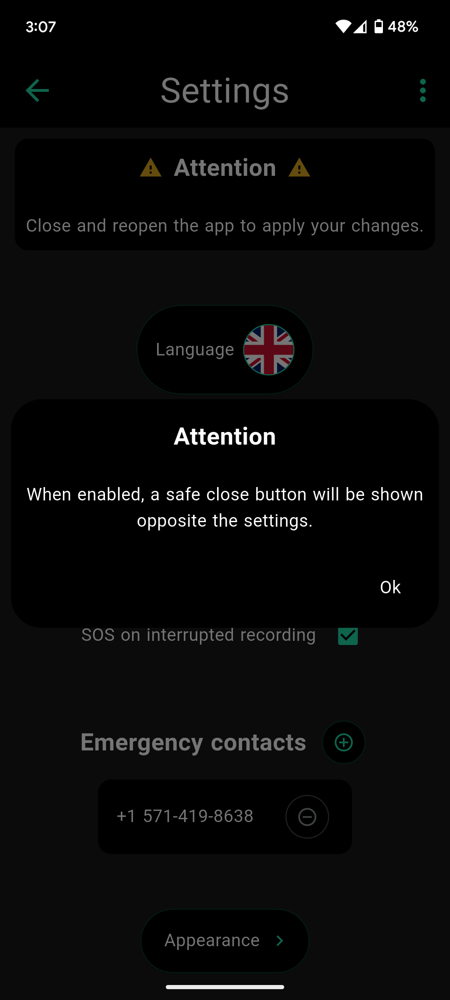

# InstaSOS
[](https://github.com/Empathetech-LLC/empathetech_flutter_ui/blob/main/localized_readme/README.ar.md)
[](https://github.com/Empathetech-LLC/empathetech_flutter_ui/blob/main/README.md)
[](https://github.com/Empathetech-LLC/empathetech_flutter_ui/blob/main/localized_readme/README.es.md)
[](https://github.com/Empathetech-LLC/empathetech_flutter_ui/blob/main/localized_readme/README.fr.md)
[](https://github.com/Empathetech-LLC/empathetech_flutter_ui/blob/main/localized_readme/README.ht.md)

<br>Hopefully unnecessary. Translations coming soon.

## <br>Table of Contents

* [Using](#using)
* [Contributing](#contributing)
* [License](#license)

# <br>Using

As civilians, our first line of defense is our cameras.<br>So, at its core, InstaSOS is a camera.


<br>When you long press the center of the screen, the app shows (or hides) a list of your rights.

| While walking | While driving | While at home |
|:-------------:|:-------------:|:-------------:|
|  |  |  |

<br>The crucial feature of InstaSOS, is the SOS button.<br>Activate it to send your location to your emergency contacts.<br>Emergency contacts are decided by you, the first time you open the app. 


<br>On iOS, the messages are automated.<br>Every 5 minutes, a message with your current location will be created (like the image above).<br>You will have to hit the send button yourself. You are also free to cancel.<br>This process is done without leaving the app, and does **not** interrupt video recordings.

On Android, the messages are fully automatic.<br>Every 5 minutes, a message with your currently location will be sent, and you can focus on the task at hand.

Because they're automatic, Android SOS's can even be sent in the background.<br>"In the background" being when the app is minimized, if you've switched to another app, or locked the phone.<br>While in the background, SOS messages will be sent every 15 minutes.

The benefits of automatic messages don't stop there.<br>On Android, you can enable "SOS on close" and "SOS on interrupted recording".


<br>While "SOS on close" is enabled, there will be a safe exit (thumbs up) button on the home screen.<br>If the app goes to the background for any reason except the safe close button, an SOS broadcast will start automatically.

| While walking | While driving |
|:-------------:|:-------------:|
|  |  |

<br>"SOS on interrupted recoding" is enabled by default.<br>If you're recording a video, and it gets interrupted, a background broadcast will start automatically.

"SOS on open" is available on both platforms.<br>While enabled, a broadcast will start as soon as the app opens.

On both platforms, press the button again to stop the broadcast.<br>While broadcasting, the button's icon will be a ringing bell, like the app icon.<br>Fully closing the app will also stop the broadcast.

## <br>Notes

### Location

Your location data is taken from the device GPS, and pasted into a maps link.<br>[location code](lib/utils/location.dart) excerpt:
```Dart
final Position pos = await Geolocator.getCurrentPosition();
return 'https://www.google.com/maps?q=${pos.latitude.toStringAsFixed(4)},${pos.longitude.toStringAsFixed(4)}';
```

### <br>Platform differences

The texting differences are due to Apple's policies.<br>They do not allow text automation, at all. They don't even have an appeal process for emergency apps.<br>Pretty hypocritical coming from a company whose marketing often implies that you aren't safe without their products, IMO.

#### <br>Timing

Why are broadcasts every 5 minutes in the foreground, but every 15 in the background?

Android limits the frequency of background tasks to save battery life (and lots of other reasons). Fifteen minutes is the max frequency.<br>But, the same limitations don't apply when the app is open.

# <br>Contributing

## Time

Please reach out to the [community](mailto:community@empathetech.net?subject=Becoming%20a%20contributor) contact about becoming a contributor. There's never a shortage of ideas, only time!

### <br>Translations

If you speak English and a currently unsupported language, please reach out! The more the merrier.

OR: If you speak English and a currently supported language, and see something wrong, please reach out! It takes a village.

## <br>Money

Empathetech makes free and open source software as a public service. Please consider donating so the work can continue. 

&nbsp;&nbsp;&nbsp;[GoFundMe](https://gofund.me/c047d07e)&nbsp;&nbsp;&nbsp;|&nbsp;&nbsp;&nbsp;[Patreon](https://patreon.com/empathetech)&nbsp;&nbsp;&nbsp;|&nbsp;&nbsp;&nbsp;[Buy Me a Coffee](https://www.buymeacoffee.com/empathetech)&nbsp;&nbsp;&nbsp;|&nbsp;&nbsp;&nbsp;[Ko-fi](https://ko-fi.com/empathetech)&nbsp;&nbsp;&nbsp;|&nbsp;&nbsp;&nbsp;[PayPal](https://www.paypal.com/donate/?hosted_button_id=NGEL6AB5A6KNL)&nbsp;&nbsp;&nbsp;|&nbsp;&nbsp;&nbsp;[Venmo](https://venmo.com/empathetech)&nbsp;&nbsp;&nbsp;|&nbsp;&nbsp;&nbsp;[Cash App](https://cash.app/$empathetech)

<br> Many thanks for any and all contributions!

# <br>License

[GNU GPLv3](./LICENSE)