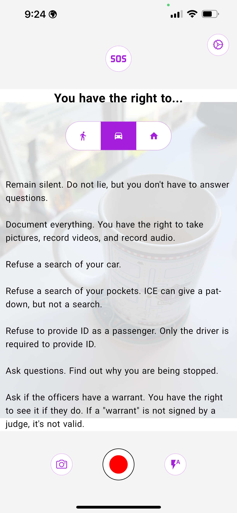
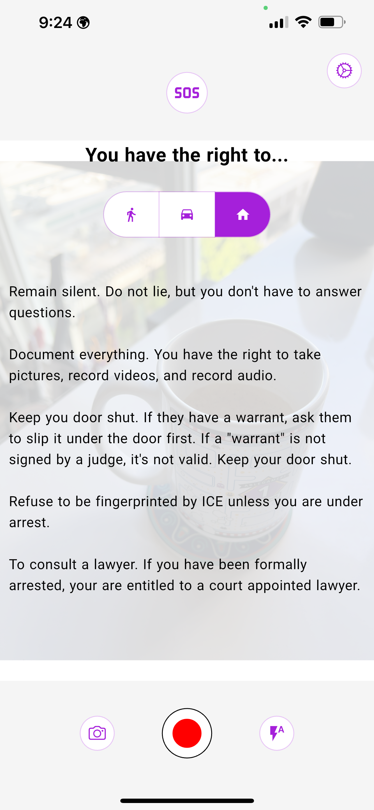
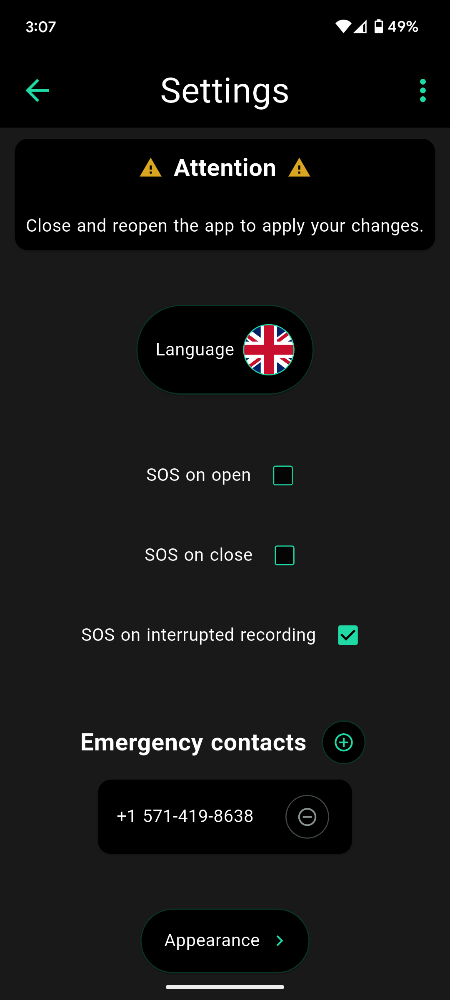

# InstaSOS
[](https://github.com/Empathetech-LLC/sos/blob/main/README.md)
[](https://github.com/Empathetech-LLC/sos/blob/main/localized_readme/README.ar.md)
[](https://github.com/Empathetech-LLC/sos/blob/main/localized_readme/README.es.md)
[](https://github.com/Empathetech-LLC/sos/blob/main/localized_readme/README.fil.md)
[](https://github.com/Empathetech-LLC/sos/blob/main/localized_readme/README.fr.md)
[](https://github.com/Empathetech-LLC/sos/blob/main/localized_readme/README.ht.md)
[](https://github.com/Empathetech-LLC/sos/blob/main/localized_readme/README.zh.md)

<br>كاميرا، ومنارة SOS، وقائمة بحقوقك، كل ذلك في مكان واحد.

يشارك InstaSOS حالتك مع جهات اتصال الطوارئ في أوقات الأزمات.

يُمكّنك من تسجيل الأدلة، ويُبقيك على اطلاع بحقوقك عند التعامل مع جهات إنفاذ القانون/الهجرة.

لا يمتلك InstaSOS أي حسابات، أو ملفات تعريف ارتباط، أو إعلانات، أو مدفوعات.

ابقَ آمنًا في الخارج.

## <br>جدول المحتويات

* [استخدام](#استخدام)
* [المساهمة](#المساهمة)
* [الترخيص](#الترخيص)

# <br>استخدام

باعتبارنا مدنيين، فإن خط الدفاع الأول لدينا هو كاميراتنا.<br>لذا، في جوهره، InstaSOS عبارة عن كاميرا.


<br>عندما تضغط لفترة طويلة على منتصف الشاشة، يعرض التطبيق (أو يخفي) قائمة بحقوقك.

| أثناء السير | أثناء القيادة | في البيت |
|:-------------:|:-------------:|:-------------:|
|  |  |  |

<br>الميزة الحاسمة في InstaSOS هي زر SOS.<br>قم بتنشيطه لإرسال موقعك إلى جهات اتصال الطوارئ الخاصة بك.<br>تحدد أنت جهات الاتصال في حالات الطوارئ، عند فتح التطبيق لأول مرة.


<br>على نظام iOS، الرسائل آلية.<br>كل 5 دقائق، سيتم إنشاء رسالة بموقعك الحالي (كما في الصورة أعلاه).<br>سيتعين عليك الضغط على زر الإرسال بنفسك. يمكنك أيضًا إلغاء الاشتراك.<br>تتم هذه العملية دون مغادرة التطبيق، ولا **تؤدي** إلى مقاطعة تسجيلات الفيديو.

على نظام Android، تكون الرسائل تلقائية بالكامل.<br>كل 5 دقائق، سيتم إرسال رسالة بموقعك الحالي، ويمكنك التركيز على المهمة المطروحة.

نظرًا لأنها تلقائية، يمكن إرسال رسائل SOS الخاصة بنظام Android حتى في الخلفية.<br>"في الخلفية" هي عندما يتم تصغير التطبيق، أو إذا قمت بالتبديل إلى تطبيق آخر، أو قفل الهاتف.<br>أثناء وجودها في الخلفية، سيتم إرسال رسائل SOS كل 15 دقيقة.

لا تتوقف فوائد الرسائل التلقائية عند هذا الحد.<br>على نظام التشغيل Android، يمكنك تمكين "SOS عند الإغلاق" و"SOS عند انقطاع التسجيل".



<br>عند تمكين "SOS عند الإغلاق"، سيكون هناك زر خروج آمن (إبهام لأعلى) على الشاشة الرئيسية.<br>إذا انتقل التطبيق إلى الخلفية لأي سبب باستثناء زر إغلاق الخزنة، فسيتم بدء بث SOS تلقائيًا.

| تذكير | بيت جديد |
|:-------------:|:-------------:|
|  |  |

<br>يتم تمكين "SOS عند انقطاع التسجيل" بشكل افتراضي.<br>إذا كنت تسجل مقطع فيديو، وتم مقاطعته، فسيتم بدء البث في الخلفية تلقائيًا.

تتوفر ميزة "SOS عند الفتح" على كلا المنصتين.<br>عند تمكينها، سيبدأ البث بمجرد فتح التطبيق.

على كلا المنصتين، اضغط على زر SOS مرة أخرى لإيقاف البث.<br>أثناء البث، سيكون رمز الزر عبارة عن جرس رنين، مثل رمز التطبيق.<br>سيؤدي إغلاق التطبيق بالكامل أيضًا إلى إيقاف البث.

## <br>ملحوظات

### موقع

يتم أخذ بيانات موقعك من نظام تحديد المواقع العالمي (GPS) الخاص بالجهاز، ولصقها في رابط الخرائط.<br>[رمز الموقع](lib/utils/location.dart) مقتطفات:
```Dart
final Position pos = await Geolocator.getCurrentPosition();
return 'https://www.google.com/maps?q=${pos.latitude.toStringAsFixed(4)},${pos.longitude.toStringAsFixed(4)}';
```

### <br>اختلافات المنصة

اختلافات الرسائل النصية تعود إلى سياسات آبل.<br>لا تسمح آبل بأتمتة الرسائل النصية إطلاقًا. ولا توفر حتى آلية استئناف لتطبيقات الطوارئ.<br>هذا نفاقٌ كبيرٌ من شركةٍ غالبًا ما توحي حملاتها التسويقية بأننا لسنا بأمان بدون منتجاتها، في رأيي.

#### <br>التوقيت

لماذا يُبثّ كل خمس دقائق في المقدمة، وكل خمس عشرة دقيقة في الخلفية؟

يُحدّد نظام أندرويد عدد مرات تشغيل مهام الخلفية لتوفير طاقة البطارية (وأسباب أخرى كثيرة). الحد الأقصى هو خمس عشرة دقيقة.<br>ولكن، لا تُطبّق هذه القيود عند فتح التطبيق.

# <br>المساهمة

## الوقت

يرجى التواصل مع مسؤول [المجتمع](mailto:community@empathetech.net?subject=Becoming%20a%20contributor) للاشتراك كمساهم. الأفكار متوفرة دائمًا، والوقت محدود!

### <br>الترجمات

إذا كنت تتحدث الإنجليزية ولغة غير مدعومة حاليًا، يُرجى التواصل معنا! كلما زاد عدد المشاركين، كان ذلك أفضل.

أو: إذا كنت تتحدث الإنجليزية ولغة معتمدة حاليًا، ولاحظت أي مشكلة، يُرجى التواصل معنا! الأمر يتطلب تكاتف الجميع.

## <br>المال

تقوم شركة Empathetech بإنشاء برامج مجانية ومفتوحة المصدر كخدمة عامة. يُرجى التبرع لمواصلة العمل.

&nbsp;&nbsp;&nbsp;[GoFundMe](https://gofund.me/c047d07e)&nbsp;&nbsp;&nbsp;|&nbsp;&nbsp;&nbsp;[Patreon](https://patreon.com/empathetech)&nbsp;&nbsp;&nbsp;|&nbsp;&nbsp;&nbsp;[Buy Me a Coffee](https://www.buymeacoffee.com/empathetech)&nbsp;&nbsp;&nbsp;|&nbsp;&nbsp;&nbsp;[Ko-fi](https://ko-fi.com/empathetech)&nbsp;&nbsp;&nbsp;|&nbsp;&nbsp;&nbsp;[PayPal](https://www.paypal.com/donate/?hosted_button_id=NGEL6AB5A6KNL)&nbsp;&nbsp;&nbsp;|&nbsp;&nbsp;&nbsp;[Venmo](https://venmo.com/empathetech)&nbsp;&nbsp;&nbsp;|&nbsp;&nbsp;&nbsp;[Cash App](https://cash.app/$empathetech)

<br>شكرا جزيلا على كل المساهمات!

# <br>الترخيص

[GNU GPLv3](./LICENSE)