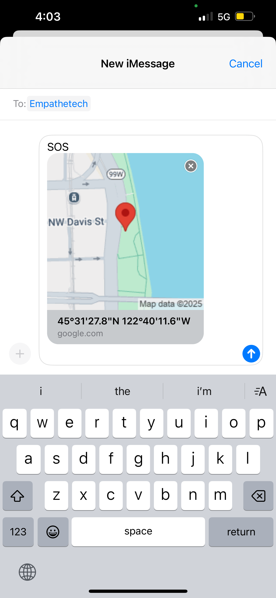

# InstaSOS
[](https://github.com/Empathetech-LLC/sos/blob/main/README.md)
[](https://github.com/Empathetech-LLC/sos/blob/main/localized_readme/README.ar.md)
[](https://github.com/Empathetech-LLC/sos/blob/main/localized_readme/README.es.md)
[](https://github.com/Empathetech-LLC/sos/blob/main/localized_readme/README.fil.md)
[](https://github.com/Empathetech-LLC/sos/blob/main/localized_readme/README.fr.md)
[](https://github.com/Empathetech-LLC/sos/blob/main/localized_readme/README.ht.md)
[](https://github.com/Empathetech-LLC/sos/blob/main/localized_readme/README.zh.md)

<br>Una cámara, una señal de SOS y una lista con tus derechos, todo en uno.

InstaSOS comparte tu estado con tus contactos de emergencia durante una crisis.

Te permite grabar evidencias y te informa de tus derechos cuando tengas que lidiar con agentes de policía o de inmigración.

InstaSOS no tiene cuentas, cookies, anuncios, ni pagos.

Seguridad ante todo.

## <br>Tabla de contenido

* [Uso](#uso)
* [Contribuir](#contribuir)
* [Licencia](#licencia)

# <br>Uso

Como ciudadanos, nuestra primera línea de defensa son nuestras cámaras.<br>Así que en esencia, InstaSOS es una cámara.


<br>Al mantener pulsado el centro de la pantalla, la aplicación muestra (u oculta) una lista con tus derechos.

| A pie | Al volante | En casa |
|:-------------:|:-------------:|:-------------:|
|  |  |  |

<br>La característica más importante de InstaSOS es el botón de SOS.<br>Actívalo para enviar tu ubicación a tus contactos de emergencia.<br>Los contactos de emergencia los decides tú la primera vez que abres la aplicación. 



<br>En iOS, los mensajes son automáticos. Cada 5 minutos se creará un mensaje con tu ubicación actual (como en la imagen de arriba).<br>Tendrás que pulsar el botón de enviar manualmente. También puedes cancelarlo.<br>Este proceso se realiza sin salir de la aplicación, y **no** interrumpe las grabaciones de vídeo.

En Android, los SMS son totalmente automáticos.<br>Cada 5 minutos se enviará un mensaje con tu ubicación actual, y podrás centrarte en lo que estés haciendo.

Como son automáticos, los SOS de Android pueden enviarse incluso en segundo plano.<br>«En segundo plano» es cuando la aplicación está minimizada, si has cambiado a otra aplicación o bloqueado el teléfono.<br>Mientras estén en segundo plano, los mensajes SOS se enviarán cada 15 minutos.

Las ventajas de los mensajes automáticos no acaban aquí.<br>En Android, puedes activar «SOS al cerrar» y «SOS al interrumpir la grabación».


<br>Mientras «SOS al cerrar» esté activado, habrá un botón de salida segura (pulgar hacia arriba) en la pantalla de inicio.<br>Si la aplicación pasa a segundo plano por cualquier motivo excepto por el botón de cierre seguro, se iniciará automáticamente una emisión de SOS.

| Recordatorio | Pantalla de inicio |
|:-------------:|:-------------:|
|  |  |

<br>La función de «SOS al interrumpir la grabación» está activada por defecto.<br>Si estás grabando un vídeo y se interrumpe, se iniciará automáticamente una transmisión en segundo plano.

«SOS al abrir» está disponible en ambas plataformas.<br>Mientras esté activada, se iniciará una transmisión en cuanto se abra la aplicación.

En ambas plataformas, pulsa de nuevo el botón de SOS para detener la transmisión.<br>Mientras se esté transmitiendo, el icono del botón será una campana sonando, como el icono de la app.<br>Cerrar por completo la app también detendrá la transmisión.

## <br>Notas

### Ubicación

Los datos de tu ubicación se toman del GPS del dispositivo y se convierten a un enlace de Google Maps.<br>Extracto de [código de ubicación](lib/utils/location.dart) excerpt:
```Dart
final Position pos = await Geolocator.getCurrentPosition();
return 'https://www.google.com/maps?q=${pos.latitude.toStringAsFixed(4)},${pos.longitude.toStringAsFixed(4)}';
```

### <br>Diferencias entre plataformas

Las diferencias en los SMS se deben a las normas de Apple.<br>No permiten la automatización de SMS bajo ningún concepto. Ni siquiera tienen un proceso de apelación para las aplicaciones de emergencia.<br>Bastante hipócrita por parte de una empresa cuyo marketing a menudo implica que no estamos protegidos sin sus productos, pero bueno.

### <br>Fuentes de derechos

- [ACLU Know Your Rights](https://www.aclu.org/know-your-rights)
- [IMMDEF Resources](https://www.immdef.org/resources)
- [Dunk the Vote: The Black Book](https://dunkthevote4ever.org/project/the-black-book-know-your-rights/)

Otro recurso: [How to document ICE](https://lab.witness.org/projects/eyes-on-ice/)

### <br>Temporización

¿Por qué se transmite cada 5 minutos en primer plano, pero cada 15 en segundo plano?

Android limita la frecuencia de las tareas en segundo plano para ahorrar batería (y muchas otras razones). Quince minutos es la frecuencia máxima.<br>Estas limitaciones no se aplican cuando la aplicación está abierta.

# <br>Contribuir

## Tiempo

Ponte en contacto con la [comunidad](mailto:community@empathetech.net?subject=Becoming%20a%20contributor) para colaborar. ¡Nunca faltan ideas, solo tiempo!

### <br>Traducciones

Si hablas inglés y un idioma no disponible en la aplicación, ¡no dudes en ponerte en contacto con nosotros! Cuantos más seamos, mejor.

O bien: si hablas inglés y un idioma disponible en la aplicación y ves algo está mal, ¡háznoslo saber! Sería una gran ayuda.

## <br>Donaciones

Empathetech hace software gratuito y de código abierto como un servicio público. Por favor, considera hacer una donación para apoyar nuestro trabajo. 

&nbsp;&nbsp;&nbsp;[GoFundMe](https://gofund.me/c047d07e)&nbsp;&nbsp;&nbsp;|&nbsp;&nbsp;&nbsp;[Patreon](https://patreon.com/empathetech)&nbsp;&nbsp;&nbsp;|&nbsp;&nbsp;&nbsp;[Buy Me a Coffee](https://www.buymeacoffee.com/empathetech)&nbsp;&nbsp;&nbsp;|&nbsp;&nbsp;&nbsp;[Ko-fi](https://ko-fi.com/empathetech)&nbsp;&nbsp;&nbsp;|&nbsp;&nbsp;&nbsp;[PayPal](https://www.paypal.com/donate/?hosted_button_id=NGEL6AB5A6KNL)&nbsp;&nbsp;&nbsp;|&nbsp;&nbsp;&nbsp;[Venmo](https://venmo.com/empathetech)&nbsp;&nbsp;&nbsp;|&nbsp;&nbsp;&nbsp;[Cash App](https://cash.app/$empathetech)

<br>¡Muchas gracias por las donaciones, grandes y pequeñas!

# <br>Licencia

[GNU GPLv3](./LICENSE)