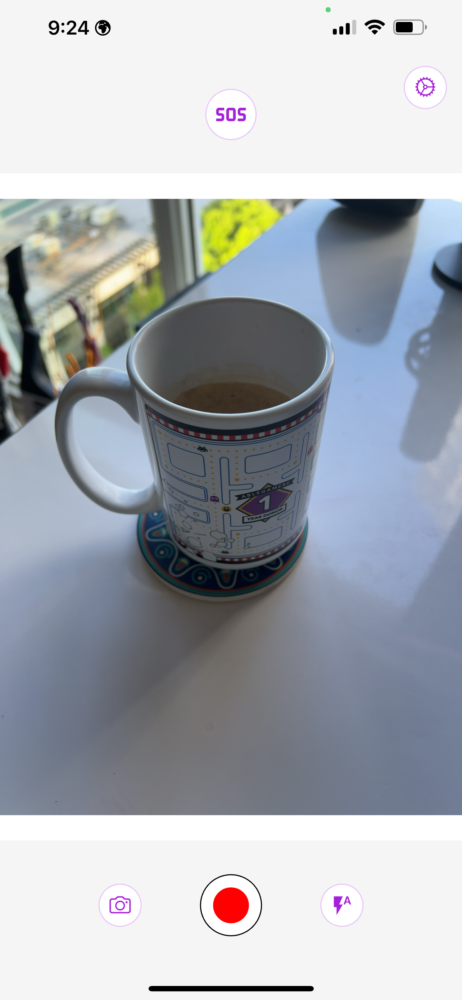

# InstaSOS
[](https://github.com/Empathetech-LLC/sos/blob/main/README.md)
[](https://github.com/Empathetech-LLC/sos/blob/main/localized_readme/README.ar.md)
[](https://github.com/Empathetech-LLC/sos/blob/main/localized_readme/README.es.md)
[](https://github.com/Empathetech-LLC/sos/blob/main/localized_readme/README.fil.md)
[](https://github.com/Empathetech-LLC/sos/blob/main/localized_readme/README.fr.md)
[](https://github.com/Empathetech-LLC/sos/blob/main/localized_readme/README.ht.md)
[](https://github.com/Empathetech-LLC/sos/blob/main/localized_readme/README.zh.md)

<br>Ang camera, SOS beacon, at ang mga tala ng iyong mga karapatan ay nasa iisang lugar.

Ibinabahagi ng InstaSOS ang iyong istado sa iyong mga emergency contact sa oras ng krisis.

Maaari kang mag-record ng ebidensya, at nagbibigay sayo ng kaalaman ukol sa iyong mga karapatan kapag nakikitungo sa mga awtoridad ng batas o imigrasyon.

Ang InstaSOS ay walang accounts, cookies, ads, o bayad.

Manatiling ligtas.

## <br>Talaan ng Nilalaman

* [Paggamit](#paggamit)
* [Pakikibahagi](#pakikibahagi)
* [Lisensya](#lisensya)

# <br>Paggamit

Bilang mga sibilyan, ang ating unang linya ng depensa ay ang ating mga kamera.<br>Kaya, sa pinakapayak na anyo, ang InstaSOS ay isang kamera.



<br>Kapag pinindot at hinawakan ang gitna ng screen, ipapakita (o itatago) ng app ang listahan ng iyong mga karapatan.

| Habang naglalakad | Habang nagmamaneho | Habang nasa bahay |
|:-------------:|:-------------:|:-------------:|
|  |  |  |

<br>Ang pangunahing tampok ng InstaSOS ay ang SOS button.<br>I-activate ito para maipadala mo ang iyong lokasyon sa iyong mga emergency contact.<br>Ikaw ang magdedesisyon kung sino ang ilalagay na mga emergency contact sa unang pagbukas mo ng app.


<br>Sa iOS, awtomatiko ang mga mensahe.<br>Kada ika-5 minuto, gumagawa ng mensahe na may kasalukuyang lokasyon mo (tulad ng larawan sa itaas).<br>Kailangan mong pindutin ang send button. Maaari ka ring mag-cancel.<br>Ang prosesong ito ay maaaring gawin nang hindi lumalabas sa app, at hindi nagdudulot ng pagkaantala o pagka-putol ng video recordings.

Sa Android, lubos na awtomatiko ang mga mensahe.<br>Kada ika-15 minuto, awtomatikong ipapadala ang mensahe na may kasalukuyang lokasyon mo, at makakapag-focus ka sa iyong ginagawa.

Dahil awtomatiko ito, puwedeng ipadala ang mga SOS ng Android kahit nasa background.<br>Ang ibig sabihin ng 'In the background' ay kapag naka-minimize ang app, kung lumipat ka sa ibang app, o kung naka-lock ang phone.<br>Habang nasa background, magpapadala ng SOS messages kada ika-15 minuto.

Hindi lang dito nagtatapos ang benepisyo ng automatic messages.<br>Sa Android, maaari mong i-enable ang "SOS on close" at "SOS on interrupted recording".


<br>Habang naka-enable ang "SOS on close", magkakaroon ng safe exit (thumbs up) button sa home screen.<br>Kung mapunta sa background ang app sa kahit anong dahilan maliban sa paggamit ng safe close button, awtomatikong magsisimula ang SOS broadcast.

| Paalala | New home |
|:-------------:|:-------------:|
|  |  |

<br>Ang "SOS on interrupted recording" ay naka-enable bilang default.<br>Kung nagre-record ka ng video at ito'y nainterrupt, awtomatikong magsisimula ang background broadcast.

Available sa parehong platform ang "SOS on open".<br>Kapag naka-enable, magsisimula ang broadcast sa pagbukas pa lang ng app.

Sa parehong platform, pindutin ulit ang SOS button para ihinto ang broadcast.<br>Habang nagba-broadcast, ang icon ng button ay magiging ringing bell, tulad ng icon ng app.<br>Ang ganap na pagsasara ng app ay siyang paghinto rin ng broadcast.

## <br>Notes

### Lokasyon

Ang data ng iyong lokasyon ay kinuha mula sa GPS ng iyong device at pasted sa link ng mapa.<br>[location code](lib/utils/location.dart) excerpt:
```Dart
final Position pos = await Geolocator.getCurrentPosition();
return 'https://www.google.com/maps?q=${pos.latitude.toStringAsFixed(4)},${pos.longitude.toStringAsFixed(4)}';
```

### <br>Pagkakaiba sa Platform

Ang pagkakaiba sa text automation ay dahil sa mga patakaran ng Apple.<br>Hindi nila pinapayagan ang text automation, kahit kailan. Wala pa nga silang appeal process para sa mga emergency app.<br>Medyo mapagkunwari mula sa isang kumpanya na madalas magpahiwatig sa kanilang marketing na hindi tayo ligtas nang wala ang kanilang mga produkto, sa palagay ko.

### <br>Mga mapagkukunan ng karapatan

- [ACLU Know Your Rights](https://www.aclu.org/know-your-rights)
- [IMMDEF Resources](https://www.immdef.org/resources)
- [Dunk the Vote: The Black Book](https://dunkthevote4ever.org/project/the-black-book-know-your-rights/)

Isa pang mapagkukunan: [How to document ICE](https://lab.witness.org/projects/eyes-on-ice/)

### <br>Timing

Bakit bawat kada ika-5 minuto ang broadcast sa foreground, pero sa background ay kada ika-15 na minuto?

Nililimitahan ng android ang frequency ng background tasks para makatipid sa battery (at iba pang dahilan). 15 minuto ang pinakamadalas na frequency.<br>Ngunit, ang parehong mga limitasyon ay hindi naaangkop kapag bukas ang app.

# <br>Pakikibahagi

## Oras

Makipag-ugnayan sa [community](mailto:community@empathetech.net?subject=Becoming%20a%20contributor) para sa pagiging contributor. Hindi nauubos ang ideya, tanging oras lang!

### <br>Mga Pagsasalin

Kung nakakapagsalita ka ng Ingles at ng isang kasalukuyang hindi suportadong wika, mangyaring makipag-ugnayan! Mas marami, mas masaya.

O: kung nakakapagsalita ka ng Ingles at ng isang kasalukuyang suportadong wika, at may napansing mali, mangyaring makipag-ugnayan! Sama-sama tayong magtutulungan.

## <br>Pera

Ang Empathetech ay gumagawa ng free at open source software bilang pampublikong pagsesebisyo. Mangyaring isaalang-alang ang pagbibigay ng donasyon upang maipagpatuloy ang gawain.

&nbsp;&nbsp;&nbsp;[GoFundMe](https://gofund.me/c047d07e)&nbsp;&nbsp;&nbsp;|&nbsp;&nbsp;&nbsp;[Patreon](https://patreon.com/empathetech)&nbsp;&nbsp;&nbsp;|&nbsp;&nbsp;&nbsp;[Buy Me a Coffee](https://www.buymeacoffee.com/empathetech)&nbsp;&nbsp;&nbsp;|&nbsp;&nbsp;&nbsp;[Ko-fi](https://ko-fi.com/empathetech)&nbsp;&nbsp;&nbsp;|&nbsp;&nbsp;&nbsp;[PayPal](https://www.paypal.com/donate/?hosted_button_id=NGEL6AB5A6KNL)&nbsp;&nbsp;&nbsp;|&nbsp;&nbsp;&nbsp;[Venmo](https://venmo.com/empathetech)&nbsp;&nbsp;&nbsp;|&nbsp;&nbsp;&nbsp;[Cash App](https://cash.app/$empathetech)

<br>Maraming salamat sa anumang kontribusyon!

# <br>License

[GNU GPLv3](./LICENSE)