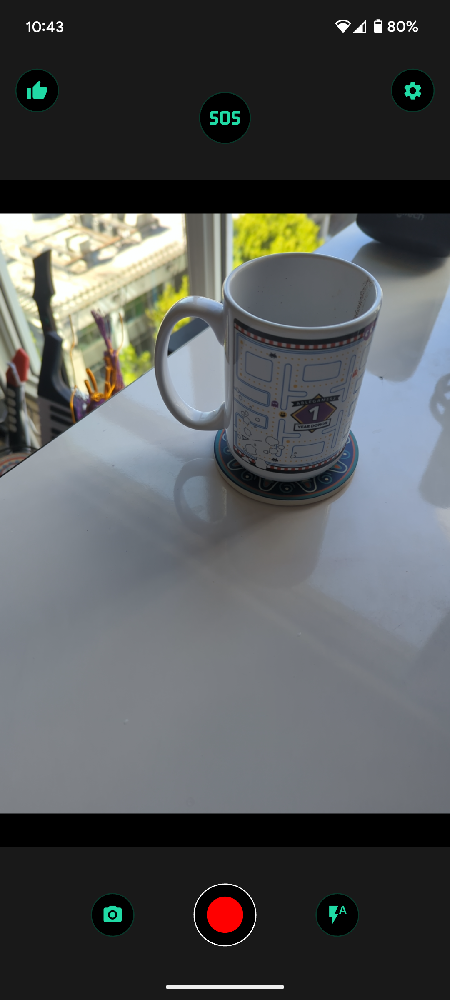

# InstaSOS
[](https://github.com/Empathetech-LLC/sos/blob/main/README.md)
[](https://github.com/Empathetech-LLC/sos/blob/main/localized_readme/README.ar.md)
[](https://github.com/Empathetech-LLC/sos/blob/main/localized_readme/README.es.md)
[](https://github.com/Empathetech-LLC/sos/blob/main/localized_readme/README.fil.md)
[](https://github.com/Empathetech-LLC/sos/blob/main/localized_readme/README.fr.md)
[](https://github.com/Empathetech-LLC/sos/blob/main/localized_readme/README.ht.md)
[](https://github.com/Empathetech-LLC/sos/blob/main/localized_readme/README.zh.md)

<br>Un appareil photo, une balise SOS et la liste de vos droits, le tout au même endroit.

InstaSOS partage votre statut avec vos contacts d'urgence en cas d'urgence.

Il vous permet d'enregistrer des preuves et vous tient informé de vos droits face aux forces de l'ordre et aux services d'immigration.

InstaSOS ne propose ni comptes, ni cookies, ni publicités, ni paiements.

Protégez-vous.

## <br>Sommaire

* [Utilisation](#utilisation)
* [Contribuer](#contribuer)
* [Licence](#licence)

# <br>Utilisation

En tant que civils, notre première ligne de défense sont nos caméras.<br>Donc, fondamentalement, InstaSOS est une caméra.


<br>Lorsque vous appuyez longuement au centre de l'écran, l'application affiche (ou masque) une liste de vos droits.

| Lorsque vous êtes piéton | Lorsque vous êtes conducteur | Lorsque vous êtes à votre domicile |
|:-------------:|:-------------:|:-------------:|
|  |  |  |

<br>La fonctionnalité la plus importante d’InstaSOS est le bouton SOS.<br>Activez-le pour envoyer votre position à vos contacts d'urgence.<br>Les contacts d'urgence sont décidés par vous, la première fois que vous ouvrez l'application.


<br>Sur iOS, les messages sont automatisés.<br>Toutes les 5 minutes, un message indiquant votre position actuelle sera créé (comme sur l'image ci-dessus).<br>Vous devrez appuyer sur le bouton d'envoi. Vous êtes également libre d'annuler.<br>Ce processus s'effectue sans quitter l'application et n'interrompt **pas** les enregistrements vidéo.

Sur Android, les messages sont entièrement automatisés.<br>Toutes les 5 minutes, un message avec votre position actuelle sera envoyé et vous pourrez vous concentrer sur la situation immédiate.

Parce qu'ils sont automatiques, les SOS Android peuvent même être envoyés en arrière-plan.<br>"En arrière-plan" signifie lorsque l'application est réduite, si vous êtes passé à une autre application ou si vous avez verrouillé le téléphone.<br>En arrière-plan, les messages SOS seront envoyés toutes les 15 minutes.

Les avantages des messages automatisés ne s'arrêtent pas là.<br>Sur Android, vous pouvez activer "SOS à la fermeture" et "SOS en cas d'enregistrement interrompu".


<br>Lorsque "SOS à la fermeture" ​​est activé, un bouton de sortie sécurisée (pouce levé) apparaît sur l'écran d'accueil.<br>Si l'application passe en arrière-plan pour une raison quelconque, à l'exception du bouton de fermeture sécurisée, une diffusion SOS démarre automatiquement.

| Rappel | Nouvel accueil |
|:-------------:|:-------------:|
|  |  |

<br>"SOS en cas d'enregistrement interrompu" est activé par défaut.<br>Si vous enregistrez une vidéo et qu'elle est interrompue, une diffusion en arrière-plan démarrera automatiquement.

"SOS à l'ouverture" ​​est disponible sur les deux plateformes.<br>Lorsqu'il est activé, une diffusion démarrera dès l'ouverture de l'application.

Sur les deux plateformes, appuyez à nouveau sur le bouton SOS pour arrêter la diffusion.<br>Pendant la diffusion, l'icône du bouton sera une cloche qui sonne, comme l'icône de l'application.<br>La fermeture complète de l'application arrêtera également la diffusion.

## <br>Notes

### Localisation

Vos données de localisation sont extraites du GPS de l'appareil et collées dans un lien Maps.<br>Extrait du [code de localisation](lib/utils/location.dart) :
```Dart
final Position pos = await Geolocator.getCurrentPosition();
return 'https://www.google.com/maps?q=${pos.latitude.toStringAsFixed(4)},${pos.longitude.toStringAsFixed(4)}';
```

### <br>Différences entre les plateformes

Les différences de SMS sont dues aux politiques d'Apple.<br>Ils n'autorisent absolument pas l'automatisation des SMS. Ils n'ont même pas de procédure d'appel pour les applications d'urgence.<br>C'est assez hypocrite de la part d'une entreprise dont le marketing laisse souvent entendre que nous ne sommes pas en sécurité sans ses produits, à mon avis.

#### <br>Intervalles

Pourquoi les diffusions sont-elles toutes les 5 minutes au premier plan, mais toutes les 15 minutes en arrière-plan ?

Android limite la fréquence des tâches en arrière-plan pour économiser la batterie (et pour d'autres raisons). L'intervalle maximum est de 15 minutes.<br>Mais ces limitations ne s'appliquent pas lorsque l'application est ouverte.

# <br>Contribuer

## Du temps

N'hésitez pas à contacter la [communauté](mailto:community@empathetech.net?subject=Becoming%20a%20contributor) pour devenir contributeur. On ne manque jamais d'idées, seulement de temps !

### <br>Une traduction

Si vous parlez anglais et une langue actuellement non prise en charge, n'hésitez pas à nous contacter ! Plus on est nombreux, mieux c'est.

OU : Si vous parlez anglais et une langue actuellement prise en charge, et que vous constatez une anomalie, n'hésitez pas à nous contacter ! Nous avons besoin de toute l’aide possible.

## <br>De l'argent

Empathetech crée des logiciels libres et open source en tant que service public. N'hésitez pas à faire un don pour que ce travail puisse se poursuivre. 

&nbsp;&nbsp;&nbsp;[GoFundMe](https://gofund.me/c047d07e)&nbsp;&nbsp;&nbsp;|&nbsp;&nbsp;&nbsp;[Patreon](https://patreon.com/empathetech)&nbsp;&nbsp;&nbsp;|&nbsp;&nbsp;&nbsp;[Buy Me a Coffee](https://www.buymeacoffee.com/empathetech)&nbsp;&nbsp;&nbsp;|&nbsp;&nbsp;&nbsp;[Ko-fi](https://ko-fi.com/empathetech)&nbsp;&nbsp;&nbsp;|&nbsp;&nbsp;&nbsp;[PayPal](https://www.paypal.com/donate/?hosted_button_id=NGEL6AB5A6KNL)&nbsp;&nbsp;&nbsp;|&nbsp;&nbsp;&nbsp;[Venmo](https://venmo.com/empathetech)&nbsp;&nbsp;&nbsp;|&nbsp;&nbsp;&nbsp;[Cash App](https://cash.app/$empathetech)

<br>Merci pour toutes vos contributions !

# <br>License

[GNU GPLv3](./LICENSE)