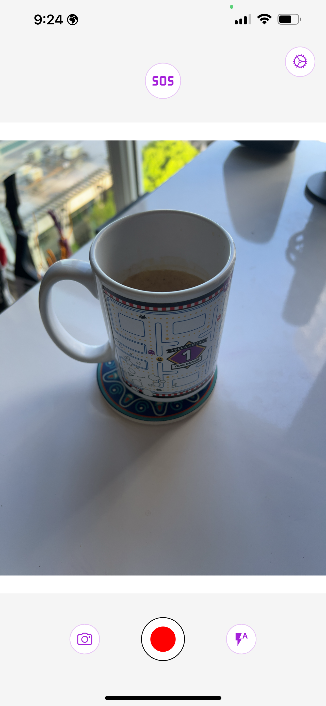
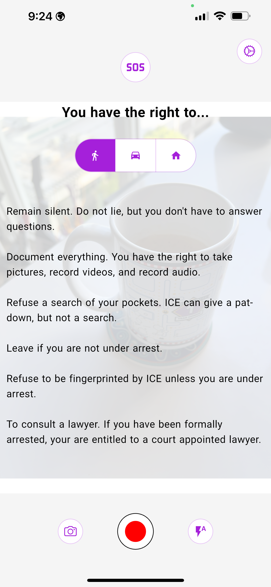
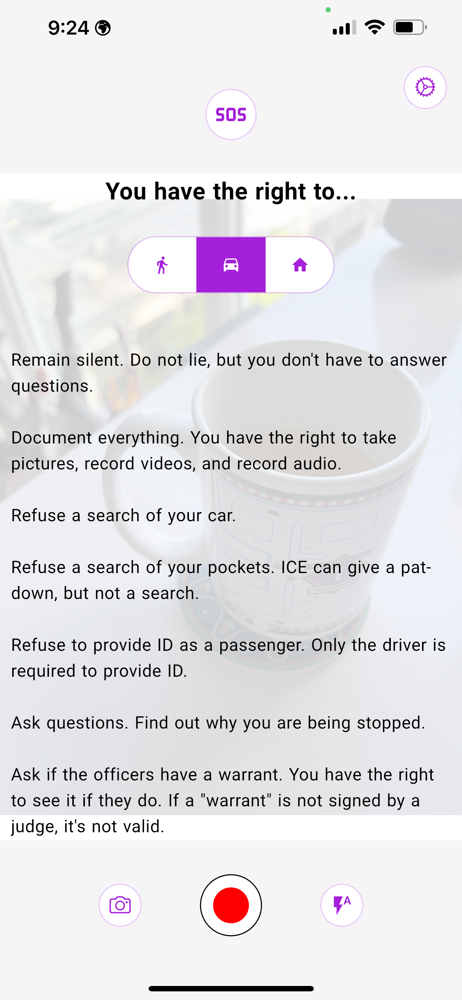
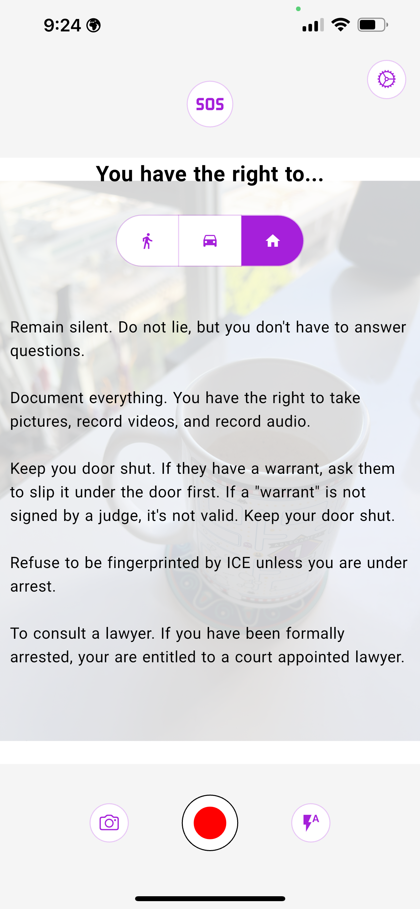
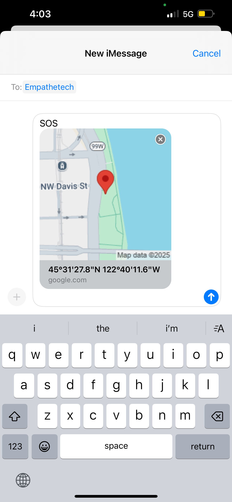
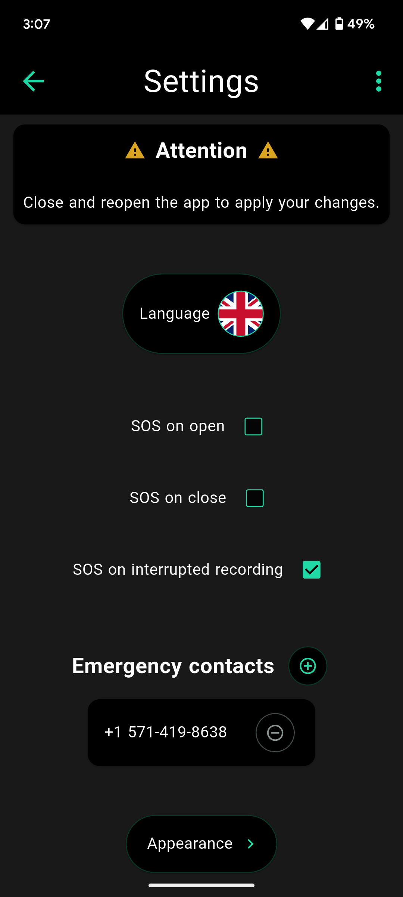
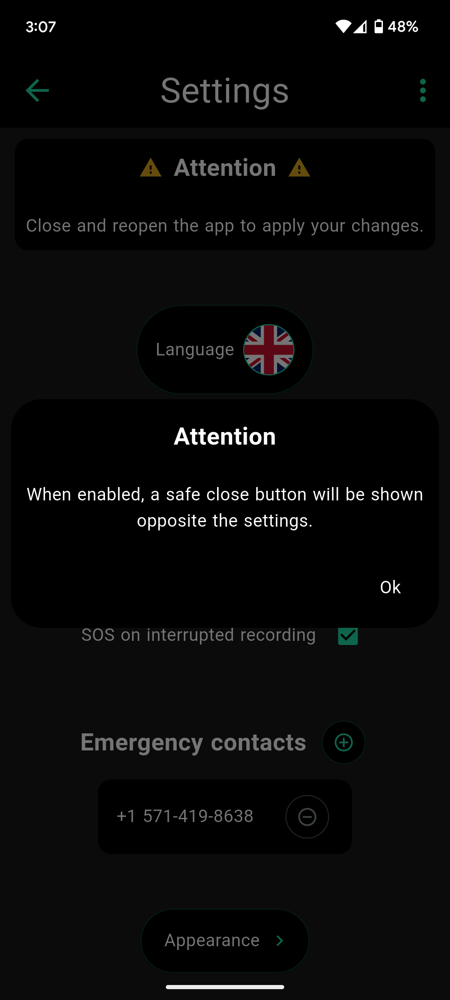
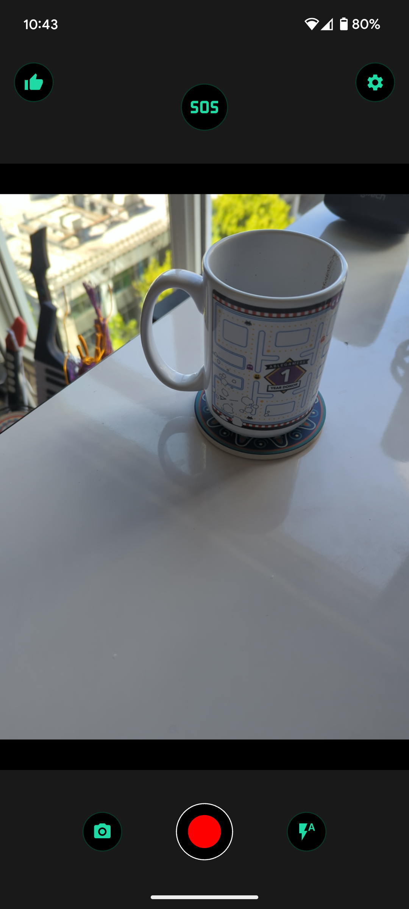

# InstaSOS
[](https://github.com/Empathetech-LLC/sos/blob/main/README.md)
[](https://github.com/Empathetech-LLC/sos/blob/main/localized_readme/README.ar.md)
[](https://github.com/Empathetech-LLC/sos/blob/main/localized_readme/README.es.md)
[](https://github.com/Empathetech-LLC/sos/blob/main/localized_readme/README.fil.md)
[](https://github.com/Empathetech-LLC/sos/blob/main/localized_readme/README.fr.md)
[](https://github.com/Empathetech-LLC/sos/blob/main/localized_readme/README.ht.md)
[](https://github.com/Empathetech-LLC/sos/blob/main/localized_readme/README.pt.md)
[](https://github.com/Empathetech-LLC/sos/blob/main/localized_readme/README.zh.md)

<br>Yon kamera, yon lanp SOS, ak yon lis dwa ou yo, tout yon sèl kote.

InstaSOS pataje estati ou ak kontak ijans ou yo nan sitiyasyon kriz.

Li pèmèt ou anrejistre prèv epi li kenbe ou enfòme konsènan dwa ou lè ou ap fè fas ak fòs lòd/lwa oswa imigrasyon.

InstaSOS pa gen plizyè kont, cookies, anons piblisitè, oswa pèman.

Rete an sekirite!

## <br>Somè

* [Itilizasyon](#itilizasyon)
* [Kontribiye](#kontribiye)
* [Lisans](#lisans)

# <br>Itilizasyon

Antan ke sitwayen sivil, premye liy defans nou se kamera nou yo.<br>Poutèt sa, fondamantalman, InstaSOS se yon kamera.



<br>Lè ou touche mitan ekran pandan plizyè segond, aplikasyon an ap afiche (oswa kache) yon lis dwa ou yo.

| Pandan ou ap mache | Pandan ou ap kondi | Lè ou lakay ou |
|:-------------:|:-------------:|:-------------:|
|  |  |  |

<br>Fonksyon esansyèl InstaSOS, se bouton SOS la.<br>Aktive li pou voye pozisyon ou bay kontak ijans ou yo.<br>Se ou menm ki chwazi kontak ijans ou yo lè ou ouvè app lan pou premye fwa. 



<br>Sou iOS, mesaj yo otomatik.<br>Chak 5 minit, yon mesaj ki genyen pozisyon ou ye a ap kreye (jan ou wè nan imaj anlè a).<br>Se ou menm ki dwe peze bouton an  pou voye mesaj la. Ou kapab anile li si ou vle.<br>Pwosesis sa fèt san ou pa kite aplikasyon an epi li **pa**  entèwonp anrejistreman videyo yo.

Sou Android, mesaj yo totalman otomatik.<br>Chak 5 minit, yon mesaj ki genyen pozisyon aktyèl ou prale, konsa ou ka rete fokis sou sa w ap fè.

Paske yo otomatik, mesaj SOS sou Android ka menm voye pandan app lan nan background.<br>"“Nan background” vle di si ou minimize app lan, chanje app, oswa fèmen ekran telefòn nan.<br>Lè app lan nan background, mesaj SOS prale chak 15 minit.

Avantaj mesaj otomatik yo pa rete la sèlman.<br>Sou Android, ou kapab aktive “SOS sou fèmti” avèk “SOS lè anrejistreman an entèwonp”.



<br>Lè “SOS sou fèmti” an aktive, ap gen yon bouton pou sòti an sekirite (sou fòm yon pous ki leve anlè) sou ekran prensipal la.<br>Si app lan ale nan background pou kèlkeswa rezon an peze bouton sòti an sekirite a, yon alèt SOS ap kòmanse otomatikman.

| Rapèl | Nouvo ekran akèy |
|:-------------:|:-------------:|
|  |  |

<br>“SOS sou anrejistreman entèwonpi” aktive pa defo.<br>Si ou ap anrejistre yon videyo epi li entèwonp, yon alèt nan background nan ap kòmanse otomatikman.

“SOS sou lansman app” la disponib sou tou de platfòm yo.<br>Lè li aktive, yon alèt ap kòmanse difize depi app lan ouvè.

Sou tou de platfòm yo, peze bouton SOS la ankò pou sispann difizyon an.<br>Pandan li ap difize, ikòn bouton an ap pran fòm yon klòch ki ap sonnen, menm jan ak ikòn app lan.

## <br>Nòt

### Pozisyon

GPS la pran done sou pozisyon ou epi li mete yo nan yon lyen Google Maps.<br>[Ekstrè kòd pozisyon ou an](lib/utils/location.dart) :
```Dart
final Position pos = await Geolocator.getCurrentPosition();
return 'https://www.google.com/maps?q=${pos.latitude.toStringAsFixed(4)},${pos.longitude.toStringAsFixed(4)}';
```

### <br>Diferans ant platfòm yo

Diferans nan voye mesaj yo sòti nan règleman Apple yo.<br>Yo **pa**  pèmèt okenn otomatizasyon mesaj ditou. Yo pa menm gen yon fason pou fè apèl pou aplikasyon ijans yo.<br>Se yon konpòtman ipokrit pou yon konpayi ki toujou fè pwomosyon pwodwi yo kòm bagay ou bezwen pou sekirite w, dapre opinyon mwen.

#### <br>Senkwonizasyon

Poukisa difizyon yo fèt chak 5 minit lè app lan ouvè, men chak 15 minit nan background?

Android mete limit sou frekans aktivite nan background pou ekonomize batri (ak lòt rezon teknik). Kenz minit se tan maksimòm. Men limit sa yo pa aplike lè app lan ouvè.

# <br>Patisipasyon

## Tan

Tanpri kontakte [kominote a](mailto:community@empathetech.net?subject=Becoming%20a%20contributor) si ou vle kontribiye. Pa janm manke lide, se tan sèlman nou manke!

### <br>Tradiksyon

Si ou pale anglè ak yon lòt lang ke nou poko sipòte, tanpri kontakte nou! Plis nou ye, pi bon sa ye.

OSWA: Si ou pale anglè ak yon lang ki deja sipòte epi ou remake gen erè, tanpri fè nou konnen! Sa mande travay yon kominote antye.

## <br>Lajan

Empathetech devlope lojisyèl gratis, ak open source tou, kòm yon sèvis piblik. Tanpri panse a fè don pou travay la ka kontinye. 

&nbsp;&nbsp;&nbsp;[GoFundMe](https://gofund.me/c047d07e)&nbsp;&nbsp;&nbsp;|&nbsp;&nbsp;&nbsp;[Patreon](https://patreon.com/empathetech)&nbsp;&nbsp;&nbsp;|&nbsp;&nbsp;&nbsp;[Buy Me a Coffee](https://www.buymeacoffee.com/empathetech)&nbsp;&nbsp;&nbsp;|&nbsp;&nbsp;&nbsp;[Ko-fi](https://ko-fi.com/empathetech)&nbsp;&nbsp;&nbsp;|&nbsp;&nbsp;&nbsp;[PayPal](https://www.paypal.com/donate/?hosted_button_id=NGEL6AB5A6KNL)&nbsp;&nbsp;&nbsp;|&nbsp;&nbsp;&nbsp;[Venmo](https://venmo.com/empathetech)&nbsp;&nbsp;&nbsp;|&nbsp;&nbsp;&nbsp;[Cash App](https://cash.app/$empathetech)

<br>Mèsi anpil pou tout kontribisyon, sou kèlkeswa fòm li ye!

# <br>Lisans

[GNU GPLv3](./LICENSE)